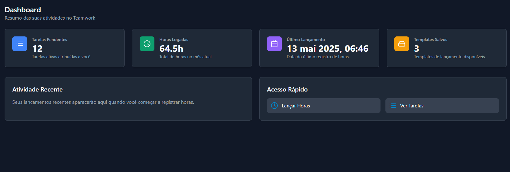
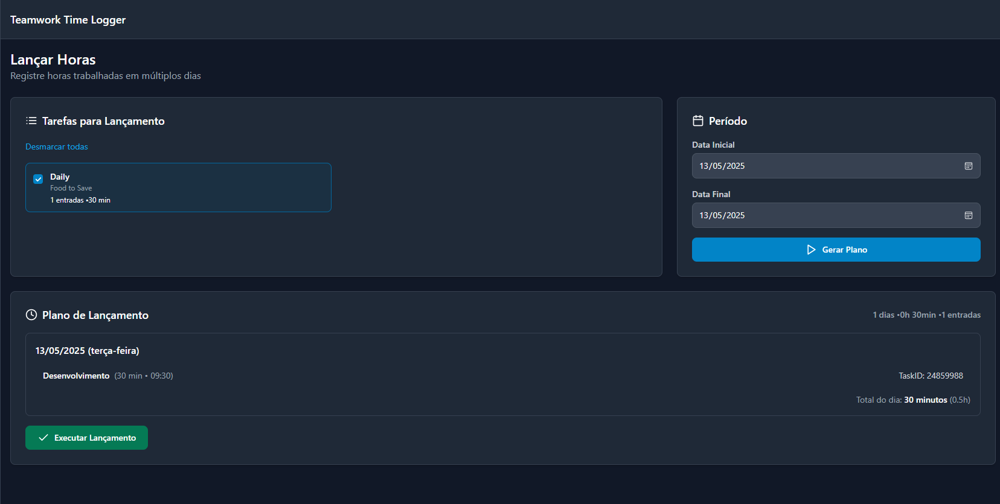
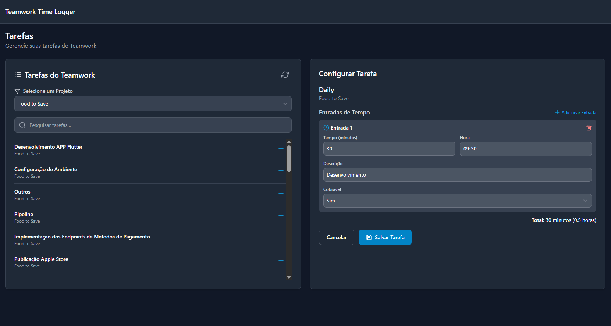
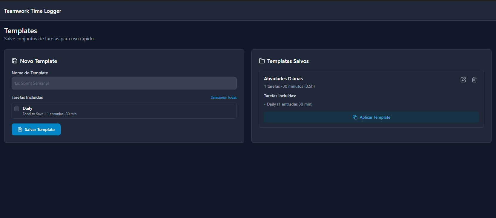
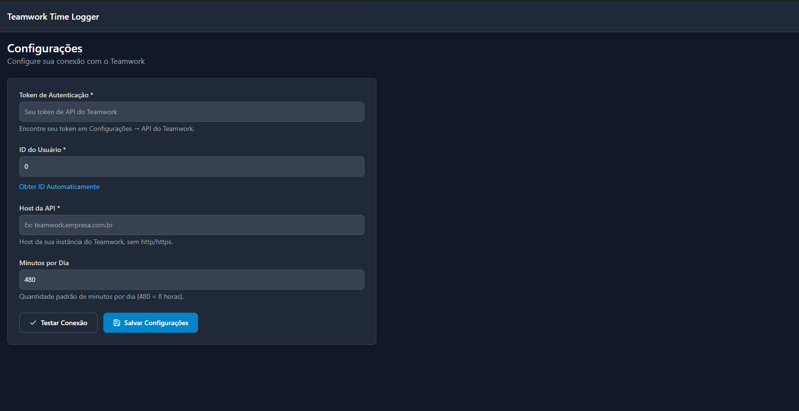

# Teamwork Time Logger


## 📝 Sobre o Projeto

O **Teamwork Time Logger** é uma aplicação desktop (Wails: Go + React) para lançar horas na plataforma Teamwork em lote, a partir de tarefas salvas e templates reutilizáveis, evitando o preenchimento manual dia a dia na interface web.

### Principais funcionalidades

- **Lançamento em lote**: distribui entradas de tempo por um intervalo de datas, pulando fins de semana e feriados
- **Tarefas salvas**: configure múltiplas entradas por tarefa, com horário, descrição e dias da semana aplicáveis
- **Templates**: salve conjuntos de tarefas e aplique-os ao módulo de lançamento
- **Calendário mensal**: visualize as horas já lançadas e os dias não úteis
- **Gerenciador de apontamentos**: liste, edite e exclua entradas de tempo de um período
- **Feriados brasileiros**: obtidos da BrasilAPI, com fallback local (inclui feriados móveis via algoritmo de Gauss)
- **Relatórios em PDF**: exportação do relatório de horas do Teamwork por período
- **Tema claro/escuro**

## 🔒 Segurança

O modelo de credenciais é deliberadamente simples:

- **Autenticação por token de API**, não por senha. O aplicativo nunca pede, transmite ou armazena a senha da sua conta Teamwork.
- **O token fica no cofre de credenciais do sistema operacional** — Credential Manager (Windows), Keychain (macOS), Secret Service (Linux). Nunca é gravado em `config.json`.
- **O token não atravessa para o frontend.** O processo Go monta o cabeçalho de autenticação; o webview recebe apenas dados já autenticados e um booleano de "configurado".
- **Somente HTTPS.** A autenticação é Basic — o token viaja em base64 em toda requisição. Endereços `http://` são recusados, e há uma verificação final antes de cada requisição sair.
- **Arquivos locais com permissão `0600`.**

### Migração de versões anteriores

Versões até a 1.0 guardavam `email:senha` em `config.json`, cifrado com AES-GCM cuja chave era derivada de uma constante presente no código-fonte — ou seja, reversível por qualquer pessoa com acesso ao arquivo.

Ao iniciar, o aplicativo **detecta e apaga** essa credencial, e exibe um aviso na tela de configuração. **Se você usou uma versão anterior, troque sua senha do Teamwork**: ela deve ser considerada exposta.

### Como obter um token de API

No Teamwork, acesse seu perfil → *Edit My Details* → aba *API & Mobile*. O caminho exato pode variar conforme a versão da sua instância.

## 🚀 Tecnologias

### Backend (Go 1.24)
- **Wails v2.10.1** — aplicação desktop híbrida
- **go-keyring** — cofre de credenciais do SO
- **HTTP client** com connection pooling e timeouts
- **Cache em memória** com TTL por tipo de dado
- **Goroutines com semáforo** para lançamentos concorrentes (limite de 3 simultâneos)

### Frontend (React 18)
- **React Router**, **TailwindCSS**, **React Icons (Feather)**
- **date-fns** com locale pt-BR
- **React Toastify**, **clsx**
- **Vite 7**

## 🛠️ Estrutura do Projeto

```
teamwork-logger/
├── backend/
│   ├── api/                # Integração com a API do Teamwork
│   │   ├── auth.go         # Validação de token e identificação do usuário
│   │   ├── client.go       # HTTP client, autenticação e barreira de HTTPS
│   │   ├── host.go         # Normalização e validação do host
│   │   ├── cache.go        # Cache com TTL
│   │   ├── tasks.go        # Tarefas
│   │   ├── projects.go     # Projetos
│   │   ├── reports.go      # Relatórios e exportação PDF
│   │   ├── time_entries.go # CRUD de apontamentos e distribuição
│   │   ├── Holiday.go      # Feriados (BrasilAPI + fallback)
│   │   └── types.go
│   ├── config/
│   │   └── config.go       # Persistência de config, tarefas e templates
│   ├── security/
│   │   └── credentials.go  # Token no cofre do SO
│   └── app.go              # Bindings expostos ao frontend
├── frontend/
│   ├── src/
│   │   ├── components/     # Sidebar, Header, MonthlyTimeCalendar,
│   │   │                   # TimeEntryManager, HolidayManager, UserProfile,
│   │   │                   # TimeInputComponent
│   │   ├── pages/          # Dashboard, Config, Task, TimeLog, Templates,
│   │   │                   # ReportPeriodModal, NotFound
│   │   └── contexts/       # ThemeContext
│   └── index.html
└── main.go
```

## 🖥️ Funcionalidades

### 📊 Dashboard



- Horas lançadas no mês, com comparação percentual ao mês anterior
- Contagem de dias úteis do mês (decorridos e restantes)
- Tarefas pendentes e projetos ativos
- **Atividades recentes**: seus últimos 5 lançamentos de tempo dos últimos 30 dias
- **Próximos prazos**: as 5 tarefas atribuídas a você com vencimento mais próximo. Tarefas sem prazo definido no Teamwork não aparecem
- Calendário visual do mês
- Exportação do relatório PDF do mês corrente

Se um desses cards falhar ao carregar, ele fica vazio e o restante do dashboard continua funcionando.

### ⏰ Lançamento de Horas



Fluxo:

1. **Selecione as tarefas** salvas (ou aplique um template)
2. **Defina o período** por data inicial/final, ou clicando num dia do calendário
3. **Gere o plano** — o backend expande as tarefas pelos dias úteis do intervalo, respeitando os `workingDays` de cada tarefa
4. **Revise** o plano completo antes de enviar
5. **Execute** — os lançamentos são enviados em paralelo (3 simultâneos, com pausa entre eles)
6. **Confira** o resultado individual de cada entrada

Fins de semana e feriados são excluídos automaticamente do plano.

> **Atenção:** não há rollback. Se parte dos lançamentos falhar, os que tiveram sucesso permanecem registrados no Teamwork. Use o Gerenciador de Apontamentos para corrigir.
>
> Também não há detecção de duplicatas: lançar o mesmo período duas vezes cria entradas duplicadas.

### 📋 Gerenciamento de Tarefas



- Importação de projetos e tarefas do Teamwork
- Busca e filtro por projeto
- Múltiplas entradas por tarefa (horário de início, duração, descrição, billable)
- Seleção dos dias da semana em que cada tarefa se aplica
- Cálculo do total de minutos configurado

### 🎯 Templates



- Salve o conjunto atual de tarefas como um template nomeado
- Aplique um template para carregá-lo no módulo de lançamento
- Exclua templates

Templates são salvos em `templates.json`. Não há versionamento nem exportação/importação entre máquinas.

### 🔧 Configuração



- Domínio da empresa e token de API
- Validação do token contra a API antes de salvar
- Logout, que remove o token do cofre do sistema

### 🗂️ Gerenciador de Apontamentos

- Listagem das entradas de tempo por período
- Edição de uma entrada (duração, horário, descrição, billable)
- Exclusão de uma entrada

> Exclusão em lote existe no backend (`DeleteMultipleTimeEntries`) mas ainda não está exposta na interface.

### 📅 Calendário Mensal

- Horas lançadas por dia
- Marcação de fins de semana e feriados
- Clique num dia para carregá-lo no módulo de lançamento

## 💾 Armazenamento Local

```
~/.teamwork-logger/
├── config.json      # host, userId, jornada diária, tarefas salvas, preferências (0600)
└── templates.json   # templates de trabalho (0600)
```

O token de API **não** fica nesses arquivos — ele reside no cofre de credenciais do sistema operacional.

O cache (projetos, tarefas, feriados, estatísticas) é mantido apenas em memória e se perde ao fechar o aplicativo.

## 🔧 Desenvolvimento

### Requisitos
- Go 1.24+
- Node.js 20+
- [Wails CLI v2.10.1](https://wails.io/docs/gettingstarted/installation)
- Linux: `libgtk-3-dev`, `libwebkit2gtk-4.0-dev` (ou 4.1)

### Rodando

```bash
git clone <repo>
cd teamwork-logger

go mod download
cd frontend && npm ci && cd ..

wails dev
```

### Testes e verificações

```bash
gofmt -l backend/ main.go   # deve não listar nada
go vet ./...
go test ./...
go test -race ./...         # requer CGO_ENABLED=1 e um compilador C

cd frontend && npm audit --audit-level=high
```

### Build de produção

```bash
wails build

# Executável gerado em:
# Windows: ./build/bin/teamwork-logger.exe
# macOS:   ./build/bin/teamwork-logger.app
# Linux:   ./build/bin/teamwork-logger
```

O CI (`.github/workflows/build.yml`) roda as verificações antes de compilar para as três plataformas e, em tags `v*`, publica uma release com checksums SHA-256.

> O instalador Windows **não é assinado digitalmente**. O SmartScreen exibirá um aviso na primeira execução.

## 🗺️ Limitações conhecidas

- Sem rollback em lançamentos parcialmente falhos
- Sem detecção de lançamentos duplicados
- Sem auto-update
- Sem modo offline — toda operação requer conexão
- Sem backup automático das configurações
- Interface disponível apenas em português

## 📜 Licença

MIT.

---

*Ferramenta interna para reduzir o trabalho manual de lançamento de horas no Teamwork.*
