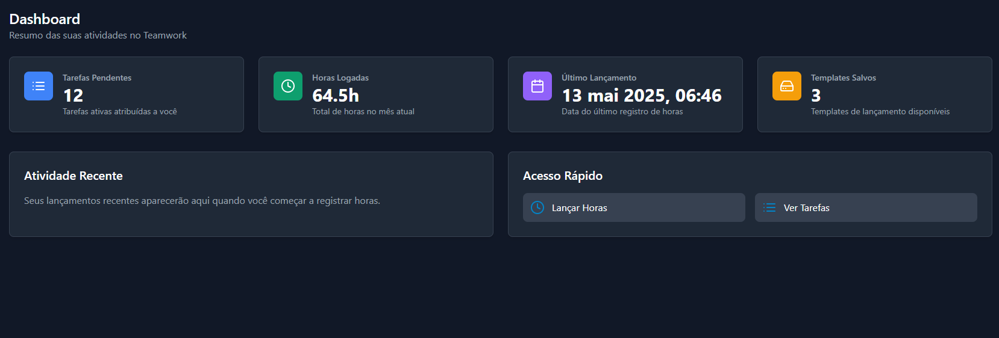
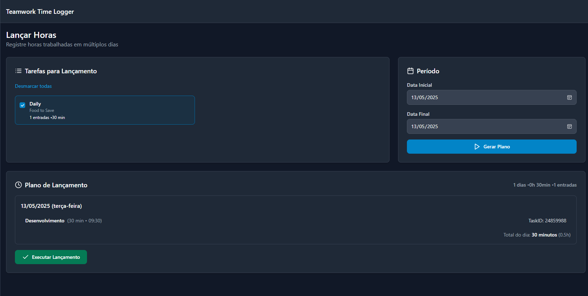
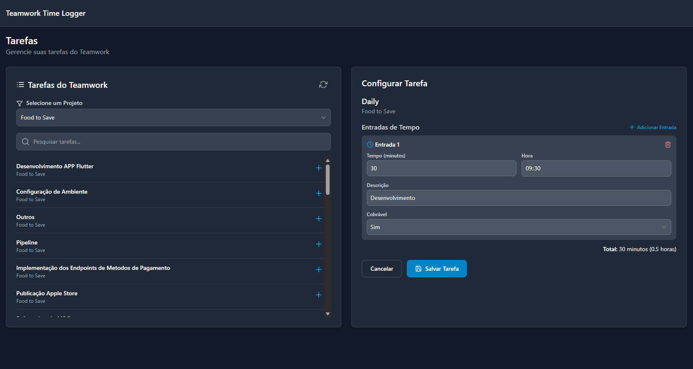
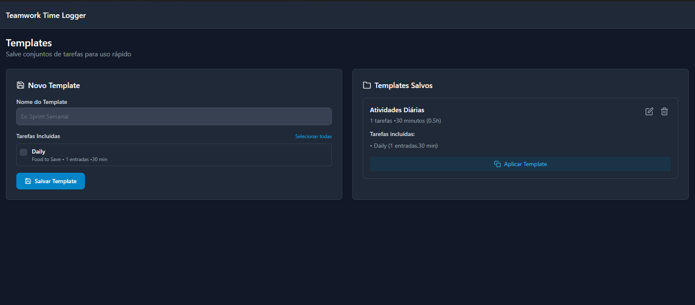
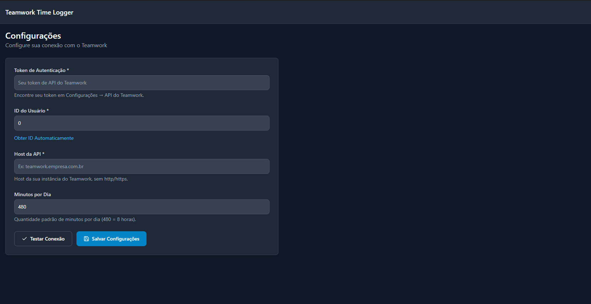

# Teamwork Time Logger


## 📝 Sobre o Projeto

O **Teamwork Time Logger** é uma aplicação desktop (Wails: Go + React) para lançar horas na plataforma Teamwork em lote, a partir de tarefas salvas e templates reutilizáveis, evitando o preenchimento manual dia a dia na interface web.

### Principais funcionalidades

- **Lançamento em lote**: distribui entradas de tempo por um intervalo de datas, pulando fins de semana e feriados
- **Tarefas salvas**: configure múltiplas entradas por tarefa, com horário, descrição e dias da semana aplicáveis
- **Templates**: salve conjuntos de tarefas e aplique-os ao módulo de lançamento
- **Calendário mensal**: visualize as horas já lançadas e os dias não úteis
- **Gerenciador de apontamentos**: liste, edite e exclua entradas de tempo de um período
- **Feriados brasileiros**: obtidos da BrasilAPI, com cache em disco e fallback local (inclui feriados móveis via algoritmo de Gauss)
- **Relatórios no app**: totais, cobrável × não cobrável, horas por dia contra a jornada, rankings por projeto/tarefa e exportação em CSV (Excel pt-BR) ou PDF
- **Calendário de trabalho**: feriados estaduais da sua UF, feriados municipais, pontes e férias entram no cálculo de dias úteis
- **Atualização automática** pelas GitHub Releases (instalação automática no Windows)
- **Logs em arquivo** para diagnóstico, com o token sempre mascarado
- **Lembretes** por notificação do sistema: horas pendentes do dia e dias incompletos no fim do mês
- **Cronômetro por tarefa** no cabeçalho, que vira lançamento ao parar
- **Tema claro/escuro**

## 🔒 Segurança

O modelo de credenciais é deliberadamente simples:

- **Autenticação por token de API**, não por senha. O aplicativo nunca pede, transmite ou armazena a senha da sua conta Teamwork.
- **O token fica no cofre de credenciais do sistema operacional** — Credential Manager (Windows), Keychain (macOS), Secret Service (Linux). Nunca é gravado em `config.json`.
- **O token não atravessa para o frontend.** O processo Go monta o cabeçalho de autenticação; o webview recebe apenas dados já autenticados e um booleano de "configurado".
- **Somente HTTPS.** A autenticação é Basic — o token viaja em base64 em toda requisição. Endereços `http://` são recusados, e há uma verificação final antes de cada requisição sair.
- **Arquivos locais com permissão `0600`.**
- **O token nunca aparece em log.** Todo log passa por um filtro que troca o token (e sua forma em Basic auth) por `[REDACTED]`, esteja ele na mensagem, num atributo ou dentro de um erro.
- **Atualizações verificadas.** O instalador baixado só é executado se o SHA-256 bater com o `SHA256SUMS.txt` da mesma release, e só de hosts do GitHub via HTTPS.

### Migração de versões anteriores

Versões até a 1.0 guardavam `email:senha` em `config.json`, cifrado com AES-GCM cuja chave era derivada de uma constante presente no código-fonte — ou seja, reversível por qualquer pessoa com acesso ao arquivo.

Ao iniciar, o aplicativo **detecta e apaga** essa credencial, e exibe um aviso na tela de configuração. **Se você usou uma versão anterior, troque sua senha do Teamwork**: ela deve ser considerada exposta.

### Como obter um token de API

No Teamwork, acesse seu perfil → *Edit My Details* → aba *API & Mobile*. O caminho exato pode variar conforme a versão da sua instância.

## 🚀 Tecnologias

### Backend (Go 1.27)
- **Wails v2.16.0** — aplicação desktop híbrida
- **go-keyring** — cofre de credenciais do SO
- **HTTP client** com connection pooling, timeouts e repetição com backoff exponencial
- **Cache em memória** com TTL por tipo de dado; feriados também em disco
- **Goroutines com semáforo** para lançamentos concorrentes (limite de 3 simultâneos)
- **log/slog** com arquivo rotativo próprio (sem dependências)
- **golang.org/x/sys/windows/registry** para detectar instalações antigas

### Frontend (React 19 + TypeScript)
- **TypeScript** em modo estrito, com os bindings tipados pelo código gerado pelo Wails
- **React Router 7**, **TailwindCSS**, **React Icons (Feather)**
- **date-fns 4** com locale pt-BR
- **React Toastify**, **clsx**
- **Vite 7**, **Vitest** + Testing Library, **ESLint** (typescript-eslint)

## 🛠️ Estrutura do Projeto

```
teamwork-logger/
├── backend/
│   ├── api/                # Integração com a API do Teamwork
│   │   ├── auth.go         # Validação de token e identificação do usuário
│   │   ├── client.go       # HTTP client, autenticação e barreira de HTTPS
│   │   ├── host.go         # Normalização e validação do host
│   │   ├── cache.go        # Cache com TTL
│   │   ├── conflicts.go    # Detecção de lançamentos duplicados
│   │   ├── dates.go        # Parsing das datas devolvidas pela API
│   │   ├── tasks.go        # Tarefas
│   │   ├── projects.go     # Projetos
│   │   ├── reports.go      # Relatórios e exportação PDF
│   │   ├── retry.go        # Política de repetição (rate limit e falhas de rede)
│   │   ├── time_entries.go # CRUD de apontamentos e distribuição
│   │   ├── Holiday.go      # Feriados (BrasilAPI + fallback)
│   │   ├── types.go
│   │   └── testdata/       # Respostas reais anonimizadas (testes de contrato)
│   ├── config/
│   │   └── config.go       # Persistência de config, tarefas e templates
│   ├── security/
│   │   └── credentials.go  # Token no cofre do SO
│   ├── logging/            # slog, arquivo rotativo e mascaramento de segredos
│   ├── update/             # Verificação/download de releases do GitHub
│   ├── legacy/             # Detecção da instalação antiga (Windows/HKLM)
│   ├── gitlog/             # Sugestão de descrição a partir do git log do dia
│   ├── internal/fsutil/    # Gravação atômica e pasta ~/.teamwork-logger
│   ├── app.go              # Ciclo de vida, conexão e fronteira do token
│   └── app_*.go            # Bindings expostos ao frontend, por domínio
├── frontend/
│   ├── src/
│   │   ├── components/     # Sidebar, Header, Modal, MonthlyTimeCalendar,
│   │   │                   # TimeEntryManager, HolidayManager, UpdateBanner,
│   │   │                   # StartupNotices, ...
│   │   ├── pages/          # Dashboard, Config, Task, TimeLog, Templates,
│   │   │                   # ReportPeriodModal, NotFound
│   │   ├── hooks/          # usePlan, useBatchSubmit, useUpdate, ...
│   │   ├── utils/          # Datas, horas, erros, repetição
│   │   ├── types/          # Tipos dos dados do backend
│   │   └── contexts/       # ThemeContext, UpdateContext
│   ├── wailsjs/            # Bindings gerados pelo Wails (alias @wailsjs)
│   └── index.html
├── tools/capturefixtures/  # Captura (só GET) e anonimiza as fixtures da API
└── main.go
```

## 🖥️ Funcionalidades

### 📊 Dashboard



- Horas lançadas no mês, com comparação percentual ao mês anterior
- Contagem de dias úteis do mês (decorridos e restantes)
- Tarefas pendentes e projetos ativos
- **Atividades recentes**: seus últimos 5 lançamentos de tempo dos últimos 30 dias
- **Próximos prazos**: as 5 tarefas atribuídas a você com vencimento mais próximo. Tarefas sem prazo definido no Teamwork não aparecem
- Calendário visual do mês
- Exportação do relatório PDF do mês corrente

Se um desses cards falhar ao carregar, ele fica vazio e o restante do dashboard continua funcionando.

### ⏰ Lançamento de Horas



Fluxo:

1. **Selecione as tarefas** salvas (ou aplique um template)
2. **Defina o período** por data inicial/final, ou clicando num dia do calendário
3. **Gere o plano** — o backend expande as tarefas pelos dias úteis do intervalo, respeitando os `workingDays` de cada tarefa
4. **Revise** o plano completo antes de enviar
5. **Execute** — os lançamentos são enviados em paralelo (3 simultâneos, com pausa entre eles)
6. **Confira** o resultado individual de cada entrada

Fins de semana e feriados são excluídos automaticamente do plano.

**Detecção de duplicatas:** ao gerar o plano, o aplicativo consulta os lançamentos já existentes no período e destaca os dias que já possuem tempo registrado, indicando quais colidem com a *mesma tarefa* do plano. Se houver colisão, o botão de envio muda de cor e exige confirmação explícita. Se a verificação em si falhar, o envio também pede confirmação — em vez de seguir em silêncio.

**Reenviar as que falharam:** se parte do lote falhar (rede, rate limit), o painel de resultados oferece um botão que reenvia **apenas** as entradas que falharam, reconstruídas a partir do plano original. O casamento é por dia e tarefa, e reenvia no máximo a quantidade de falhas de cada combinação — nunca reenvia uma entrada que já deu certo, evitando duplicar horas. Os sucessos anteriores são preservados, inclusive para o desfazer.

**Desfazer lançamento:** após executar, o painel de resultados oferece um botão que apaga do Teamwork as entradas criadas por aquele lote. Útil quando parte das entradas falha, ou quando o plano estava errado.

**Repetição automática:** um lote grande costuma esbarrar no rate limit da API. Requisições recusadas com `429` são repetidas até 3 vezes, com backoff exponencial (500 ms, 1 s, 2 s…, teto de 8 s), respeitando o cabeçalho `Retry-After` quando o servidor o envia. Falhas de rede e erros `5xx` só são repetidos em métodos idempotentes — **um `POST` que falha nunca é reenviado**, porque não há como saber se o lançamento chegou a ser criado, e repetir duplicaria horas. Nesses casos a entrada aparece como falha no painel de resultados e pode ser reenviada manualmente.

Fechar o aplicativo cancela o que estiver em voo: as requisições carregam o contexto da aplicação, e a espera do backoff é interrompida em vez de segurar o encerramento por até 8 segundos.

> **Atenção:** o desfazer depende do identificador que o Teamwork devolve ao criar cada entrada. Se algum lançamento vier sem esse identificador, o painel informa quantos ficaram de fora — esses precisam ser removidos pelo Gerenciador de Apontamentos.
>
> O aviso de duplicata não bloqueia o envio: lançamentos são **somados**, não substituídos.

### 🎯 Completar Período

Escolha um mês (por padrão, do dia 1 até hoje; marque "mês inteiro" para incluir os dias que ainda não chegaram) e um template ou um conjunto de tarefas salvas. O aplicativo lê quanto já foi lançado em cada dia útil e monta um plano que lança **só o que falta** para atingir a jornada diária configurada: as entradas são usadas na ordem do template, a última é encurtada para não passar da jornada, dias completos ficam de fora e os dias da semana de cada tarefa são respeitados. Déficits menores que a granularidade escolhida (padrão 15 min) não geram lançamento. Como a API não informa o horário dos lançamentos existentes, o início das novas entradas é estimado a partir do primeiro horário do template mais o que já foi lançado no dia. Um resumo por dia mostra lançado, faltante e a lançar; o envio usa o mesmo fluxo do Lançamento de Horas (verificação de duplicatas, reenviar falhas e desfazer).

### 🗓️ Semana

Grade tarefa × dia (segunda a sexta, com opção de mostrar sábado e domingo), com navegação entre semanas, totais por dia e por tarefa, dias abaixo da jornada em destaque e fins de semana/feriados em cinza. As linhas são as tarefas com lançamento na semana mais as tarefas salvas. Digitar um valor **maior** numa célula cria um lançamento só com a diferença (descrição, horário e billable vêm da tarefa salva e podem ser ajustados); para **reduzir**, a célula abre a lista dos seus lançamentos para editar ou apagar um a um — nada é apagado automaticamente. **Copiar semana anterior** monta um plano com os lançamentos da semana passada no mesmo dia da semana (pulando dias não úteis), revisável e enviado com verificação de duplicatas, reenvio de falhas e desfazer.

### 📋 Gerenciamento de Tarefas



- Importação de projetos e tarefas do Teamwork
- Busca e filtro por projeto
- Múltiplas entradas por tarefa (horário de início, duração, descrição, billable)
- Seleção dos dias da semana em que cada tarefa se aplica
- Cálculo do total de minutos configurado

### 🎯 Templates



- Salve o conjunto atual de tarefas como um template nomeado
- Aplique um template para carregá-lo no módulo de lançamento
- Exclua templates

Templates são salvos em `templates.json`. Não há versionamento nem exportação/importação entre máquinas.

### 🔧 Configuração



- Domínio da empresa e token de API
- Validação do token contra a API antes de salvar
- Logout, que remove o token do cofre do sistema
- **Sobre / Atualizações**: versão atual, botão "Verificar atualizações" e a opção "Verificar atualizações ao iniciar"
- **Diagnóstico**: caminho do arquivo de log e atalho para abrir a pasta
- **Integração com Git**: repositórios locais (e e-mail do autor, opcional) cujos commits do dia viram sugestão de descrição. O botão "Sugerir pelos commits" aparece na edição de lançamentos e nas entradas das tarefas salvas; ele lista os commits do dia (sem merges, só os seus) para você escolher quais entram. Os assuntos são juntados por "; " sem os prefixos Conventional Commits (`feat:`, `fix(api):`...), sem repetições, agrupados por repositório quando há mais de um e limitados a 250 caracteres. Requer o `git` no PATH; nada é escrito nos repositórios.

Quando há versão nova, um aviso no topo da janela mostra as novidades da release e oferece "Atualizar agora" (Windows, com barra de progresso) ou "Abrir página da versão"; dá para dispensá-lo até a próxima abertura. Na inicialização o app também avisa se a configuração estava corrompida (listando os backups) e, no Windows, se há uma instalação antiga para remover.

### 🗂️ Gerenciador de Apontamentos

- Listagem das entradas de tempo por período
- Filtros por projeto, tarefa, faixa de horas e billable
- Edição de uma entrada (duração, horário, descrição, billable)
- **Exclusão em lote**: selecione as entradas pela caixa de marcação (ou "Selecionar todas") e apague de uma vez, com um painel mostrando o resultado de cada uma

A exclusão em lote roda no backend (`DeleteMultipleTimeEntries`), com 3 exclusões simultâneas, respiro entre elas e a mesma política de repetição em rate limit das demais chamadas. Entradas já deletadas não são selecionáveis. Se alguma exclusão falhar, o painel de resultados oferece **reenviar só as que falharam**.

### 📅 Calendário Mensal

- Horas lançadas por dia
- Marcação de fins de semana, feriados (nacionais, estaduais, municipais e pontes) e férias, com legenda
- Clique num dia para carregá-lo no módulo de lançamento

### 🔔 Lembretes

Notificações nativas do sistema avisam no horário configurado (padrão 18:00, só em dias úteis, respeitando feriados) quando o dia ainda não fechou a jornada — "Faltam 2h 30min para fechar o dia", com o botão "Lançar agora" — e, nos últimos dias úteis do mês (padrão: os 2 últimos), listam os dias úteis incompletos ("3 dias pendentes: 02, 07, 15") com "Completar o mês". Cada lembrete sai no máximo uma vez por dia, mesmo reiniciando o app, e clicar nele traz a janela para frente na tela certa. Tudo é ajustável na seção **Lembretes** da Configuração, que também tem o botão "Testar lembrete" e avisa quando as notificações do sistema não estão disponíveis.

### ⏱️ Cronômetro por tarefa

O botão **Cronômetro** no cabeçalho inicia a contagem numa tarefa salva ou buscada no Teamwork; o widget mostra a tarefa e o tempo correndo, com pausar, retomar e parar. Ao parar, um diálogo mostra o lançamento previsto (um por dia, se passou da meia-noite, com o horário real de início) para revisar minutos e descrição antes de lançar — ou descartar. O cronômetro sobrevive a fechar o app, arredonda por minuto (ou em múltiplos de 15, configurável) e, se ficar rodando mais de 4 horas (configurável), uma notificação pergunta "Esqueceu o cronômetro ligado?" com "Parar e lançar" e "Continuar".

### 📈 Relatórios

A página **Relatórios** resume um período (este mês, mês passado, esta semana, últimos 30 dias ou datas personalizadas, até 366 dias): total lançado, cobrável × não cobrável, jornada esperada (dias úteis × jornada diária) e saldo, colunas de horas por dia com a jornada como linha de referência (dias úteis sem lançamento aparecem zerados), rankings por projeto e por tarefa, totais por semana e uma tabela por tarefa ordenável. Só entram os lançamentos não excluídos do usuário conectado. O **CSV** sai na mesma pasta do PDF (`~/TeamworkReports`), pronto para o Excel em português: separador `;`, UTF-8 com BOM, vírgula decimal e datas dd/mm/aaaa. Há duas versões — **detalhada** (data, projeto, tarefa, descrição, início, minutos, horas, cobrável) e **resumida** (por projeto/tarefa) — e textos que começam com `=`, `+`, `-` ou `@` recebem um apóstrofo para não virarem fórmula.

### 🗓️ Calendário de Trabalho (feriados estaduais, municipais, pontes e férias)

No **Gerenciamento de Feriados** (botão no Dashboard), a seção *Calendário de trabalho* permite escolher a **UF**, cujos feriados estaduais de data fixa passam a valer (a tabela embutida é conservadora e cada feriado pode ser desmarcado), cadastrar **feriados municipais, pontes e outras folgas** (numa data ou repetindo todo ano) e **períodos de férias/ausência**. Esses dias deixam de ser úteis na distribuição de horas, no calendário mensal, no Dashboard e nos relatórios, e aparecem com tipo próprio (`state_holiday`, `municipal`, `bridge`, `custom`, `vacation`). A configuração fica em `config.json` (campo `calendar`); arquivos de versões anteriores continuam valendo, sem nenhum dia extra.

## 💾 Armazenamento Local

```
~/.teamwork-logger/
├── config.json              # host, userId, jornada diária, tarefas salvas, preferências (0600)
├── templates.json           # templates de trabalho (0600)
├── reminders.json           # último dia em que cada lembrete foi enviado (0600)
├── timer.json               # cronômetro em andamento, se houver (0600)
├── cache/
│   └── holidays-<ano>.json  # feriados da BrasilAPI por ano (0600)
└── logs/
    ├── app.log              # log atual (0600)
    └── app.log.1 … .3       # logs anteriores
```

O token de API **não** fica nesses arquivos — ele reside no cofre de credenciais do sistema operacional.

- O diretório é criado com `0700`; arquivos e diretório de instalações antigas têm as permissões corrigidas na inicialização.
- As gravações são atômicas (arquivo temporário + `rename`): uma queda no meio da escrita deixa a versão anterior intacta, nunca um JSON pela metade.
- Se `config.json` ou `templates.json` estiver corrompido, o aplicativo abre mesmo assim com a configuração padrão e renomeia o arquivo para `<nome>.corrompido-<data-hora>` na mesma pasta, para inspeção.
- Versões antigas gravavam esses arquivos ao lado do executável; eles são migrados para `~/.teamwork-logger/` só se ainda não houver configuração lá.

O cache de projetos, tarefas e estatísticas é mantido apenas em memória e se perde ao fechar o aplicativo.

### Cache de feriados

Os feriados de cada ano vindos da BrasilAPI são gravados em `cache/holidays-<ano>.json` (gravação atômica) e carregados na inicialização:

- Por **30 dias** o ano é servido do cache, sem rede.
- Depois disso o dado antigo continua sendo usado na hora e é **revalidado em segundo plano**.
- Se a BrasilAPI estiver fora, vale o último dado dela em disco (nova tentativa em 6 h); sem nada em disco, entra o calendário local, que não vai para o disco.
- "Limpar cache" e "Atualizar ano" no gerenciador de feriados apagam também os arquivos.

### Logs

O aplicativo registra eventos e erros em `~/.teamwork-logger/logs/app.log` (formato texto do `log/slog`). O arquivo gira ao passar de **5 MB**, mantendo os 3 anteriores (`app.log.1` a `app.log.3`) — no máximo ~20 MB. A tela do app oferece abrir a pasta de logs para anexar a um pedido de suporte.

- Nível padrão **Info**. Para diagnóstico detalhado (requisições, corpos de resposta resumidos), defina `TEAMWORK_LOGGER_DEBUG=1` antes de abrir o app.
- Em `wails dev` (ou com o debug ligado) o log também sai no terminal.
- O token de API nunca é gravado: é mascarado como `[REDACTED]`. Valores rotulados com "token" ou "password" também são descartados.

## 🔧 Desenvolvimento

### Requisitos
- Go 1.27+ (o `toolchain` do go.mod baixa a versão certa automaticamente)
- Node.js 22+ (o Vite 7 não roda no Node 18)
- [Wails CLI v2.16.0](https://wails.io/docs/gettingstarted/installation): `go install github.com/wailsapp/wails/v2/cmd/wails@v2.16.0`
- Windows, para gerar o instalador: [NSIS](https://nsis.sourceforge.io/Download) com `makensis` no `PATH`
- Linux (Ubuntu 22.04+/Debian 12+): `build-essential pkg-config libgtk-3-dev libwebkit2gtk-4.1-dev`, e a build tag `webkit2_41` em todo `wails dev`/`wails build`

### Rodando

```bash
git clone <repo>
cd teamwork-logger

go mod download
cd frontend && npm ci && cd ..

wails dev                    # Linux: wails dev -tags webkit2_41
```

`frontend/dist/index.html` é um placeholder versionado: `main.go` embute `frontend/dist` com `//go:embed`, e sem ele `go vet`/`go test` não compilam antes do frontend existir. Um `npm run build`/`wails build` o sobrescreve — não comite essa versão (`git checkout -- frontend/dist/index.html` restaura).

Ao mudar um binding em `backend/app*.go`, rode `wails generate module` e comite o que mudar em `frontend/wailsjs/`.

### Testes e verificações

```bash
gofmt -l backend/ main.go tools/   # deve não listar nada
go vet ./...
go test ./...
go test -race ./...         # requer CGO_ENABLED=1 e gcc (no Windows: MinGW, ex. `scoop install mingw`)

cd frontend
npm run typecheck           # TypeScript estrito
npm run lint                # ESLint, sem avisos
npm test                    # Vitest
npm run coverage            # Vitest com cobertura
npm audit --audit-level=high
```

### Build de produção

```bash
wails build -platform windows/amd64 -nsis   # Windows: executável + instalador
wails build -platform darwin/universal      # macOS
wails build -platform linux/amd64 -tags webkit2_41

# Saída em ./build/bin/:
# Windows: teamwork-logger.exe e TeamworkLogger-amd64-installer.exe
# macOS:   teamwork-logger.app
# Linux:   teamwork-logger
```

O instalador Windows é o do próprio Wails (`-nsis`), definido em `build/windows/installer/project.nsi` — é ali que ficam as personalizações, porque o `wails_tools.nsh` ao lado é regenerado a cada build. Ele instala **por usuário**, sem pedir administrador, em `%LOCALAPPDATA%\Programs\Teamwork Logger`, com atalhos no menu Iniciar e na área de trabalho e desinstalador em *Aplicativos instalados*. Nome, empresa e versão vêm de `info` em `wails.json`.

Não há scripts de build próprios na raiz: tudo passa pelo Wails CLI, local ou no CI.

### Versão e releases

A versão do app é `info.productVersion` em `wails.json` (e `version` em `frontend/package.json`, mantida igual). O CI (`.github/workflows/build.yml`) roda as verificações antes de compilar para as três plataformas e, em tags `vX.Y.Z`, grava a versão da tag em `wails.json` antes do build e publica uma release com:

- `teamwork-logger.exe` (portátil) e `TeamworkLogger-amd64-installer.exe` (instalador)
- `naipe-logger-linux.AppImage`
- `naipe-logger-macos.dmg` e `naipe-logger-macos.app.zip`
- `SHA256SUMS.txt`

Tags fora do formato `vX.Y.Z` (ex.: `v1.2.0-rc1`) falham no build, porque o Windows exige versão numérica no executável e no instalador.

Os nomes "Naipe Logger"/"Teamwork Logger" convivem por compatibilidade: o diretório de configuração (`~/.teamwork-logger`), o identificador no cofre do sistema (`com.teamwork-logger`) e os nomes dos artefatos publicados são mantidos para não quebrar instalações e links existentes.

A versão é embutida no binário: `main.go` faz `//go:embed wails.json` e lê `info.productVersion` (exposta ao frontend por `GetAppVersion`). Builds de `wails dev` recebem o sufixo `-dev` (ex.: `1.0.0-dev`).

### Atualização automática

O app consulta a API pública do GitHub (`/repos/eddie-naipes/naipe-logger/releases/latest`) — sem servidor próprio nem custo:

- Na inicialização, se a preferência **"Verificar atualizações ao iniciar"** (`checkUpdatesOnStartup`, ligada por padrão) estiver ativa. O resultado fica em cache por 1 h, para respeitar o limite de 60 consultas/h da API anônima.
- Rascunhos e pré-releases nunca são oferecidos.
- **Windows:** o app baixa `TeamworkLogger-amd64-installer.exe` e o `SHA256SUMS.txt` da **mesma** release, confere o SHA-256, executa o instalador e se fecha. Downloads só são aceitos via HTTPS de `github.com`, `api.github.com`, `objects.githubusercontent.com` e `release-assets.githubusercontent.com` (inclusive em cada redirecionamento); checksum divergente ou ausente descarta o arquivo.
- **macOS/Linux:** o app avisa da versão nova e abre a página da release para download manual.
- **Builds de desenvolvimento** (versão com sufixo, ex. `-dev`) verificam, mas nunca instalam.

### Instalação antiga (Windows)

Versões anteriores instalavam como administrador em `C:\Program Files\...` e registravam o desinstalador em `HKLM` (*Naipe Logger* ou *Teamwork Logger*). O instalador atual é por usuário, então quem atualiza pode ficar com duas cópias. O app detecta a instalação antiga (chaves `HKLM\Software\Microsoft\Windows\CurrentVersion\Uninstall\*` com esses nomes, em pasta diferente da do executável em uso) e oferece rodar o desinstalador dela — o Windows pede confirmação de administrador (UAC). As configurações em `~/.teamwork-logger` não são afetadas.

### Aviso do SmartScreen no Windows

O instalador Windows **não é assinado digitalmente** (um certificado de assinatura de código tem custo anual). Por isso, na primeira execução o **Microsoft Defender SmartScreen** mostra "O Windows protegeu o computador".

Para prosseguir, o próprio usuário confirma que confia no arquivo:

1. Clique em **Mais informações**
2. Clique em **Executar assim mesmo**

Antes disso, vale conferir que o download é autêntico comparando o hash do arquivo com o publicado em `SHA256SUMS.txt` na release:

```powershell
Get-FileHash .\TeamworkLogger-amd64-installer.exe -Algorithm SHA256
```

O valor deve bater com a linha correspondente no `SHA256SUMS.txt` daquela versão. O aviso desaparece quando o app ganha reputação suficiente no SmartScreen, ou de vez com um certificado de assinatura — nenhum dos dois está em vigor hoje.

## 🗺️ Limitações conhecidas

- O desfazer de lote depende do ID devolvido pela API; entradas sem ID precisam ser removidas manualmente
- A leitura de apontamentos de um período pagina até 50 páginas (25 mil entradas). O teto existe para evitar laço infinito caso a API devolva `hasMore` indefinidamente; períodos reais ficam muito abaixo disso
- Um `POST` que falha por rede ou erro do servidor não é reenviado automaticamente (evita duplicar horas) — só o rate limit `429` dispara repetição
- A atualização automática só instala sozinha no Windows; no macOS e no Linux o download é manual pela página da release
- O instalador não é assinado: após uma atualização automática o SmartScreen pode avisar de novo
- Sem modo offline — toda operação requer conexão (só os feriados ficam em disco)
- Sem backup automático das configurações
- Interface disponível apenas em português

## 📜 Licença

MIT.

---

*Ferramenta interna para reduzir o trabalho manual de lançamento de horas no Teamwork.*
