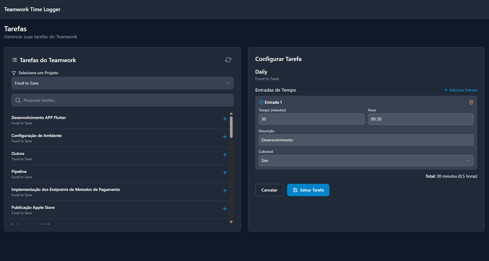

# Teamwork Time Logger


## 📝 Sobre o Projeto

O **Teamwork Time Logger** é uma aplicação desktop robusta desenvolvida com Wails (Go + React) que revoluciona o processo de lançamento de horas na plataforma Teamwork. Projetada para maximizar a produtividade, oferece funcionalidades avançadas como lançamentos em lote, gerenciamento inteligente de templates e integração completa com a API do Teamwork.

### 🌟 Principais Características

- **Lançamento em lote inteligente**: Registre horas em múltiplas tarefas e dias automaticamente
- **Sistema de templates avançado**: Crie e reutilize configurações de trabalho complexas
- **Calendário visual interativo**: Visualize e gerencie seus registros mensais
- **Gerenciamento completo de apontamentos**: Edite, delete e organize suas entradas de tempo
- **Dashboard analítico**: Métricas e insights sobre sua produtividade
- **Interface moderna**: Design responsivo com tema escuro/claro
- **Performance otimizada**: Cache inteligente e operações assíncronas
- **Segurança robusta**: Criptografia AES-GCM para dados sensíveis

## 🚀 Tecnologias Utilizadas

### Backend (Go 1.24)
- **Wails v2.10.1**: Framework para aplicações desktop híbridas
- **HTTP Client otimizado**: Connection pooling e timeouts configuráveis
- **Sistema de cache**: Cache com TTL para otimização de performance
- **Criptografia**: AES-GCM para proteção de tokens e dados sensíveis
- **Concorrência**: Goroutines com semáforos para operações paralelas

### Frontend (React)
- **React Router**: Navegação SPA fluida
- **TailwindCSS**: Styling utility-first responsivo
- **React Icons (Feather)**: Iconografia consistente
- **date-fns**: Manipulação avançada de datas com i18n (pt-BR)
- **React Toastify**: Sistema de notificações elegante
- **clsx**: Conditional CSS classes

## 🛠️ Arquitetura do Projeto

Arquitetura híbrida com backend Go gerenciando API e persistência, frontend React proporcionando UX moderna.

### Estrutura de Diretórios

```
teamwork-logger/
├── backend/
│   ├── api/           # Integração completa com Teamwork API
│   │   ├── auth.go    # Autenticação e tokens
│   │   ├── tasks.go   # Gerenciamento de tarefas
│   │   ├── projects.go # Operações de projetos
│   │   ├── reports.go # Relatórios e exportação
│   │   └── time_entries.go # CRUD de apontamentos
│   ├── config/        # Configurações e templates
│   │   └── manager.go # Gerenciador de configurações
│   ├── security/      # Criptografia e segurança
│   └── app.go         # Facade da aplicação
├── frontend/
│   ├── src/
│   │   ├── components/    # Componentes reutilizáveis
│   │   │   ├── Sidebar.jsx
│   │   │   ├── Header.jsx
│   │   │   ├── MonthlyTimeCalendar.jsx
│   │   │   ├── TimeEntryManager.jsx
│   │   │   └── UserProfile.jsx
│   │   ├── pages/         # Páginas principais
│   │   │   ├── Dashboard.jsx
│   │   │   ├── Config.jsx
│   │   │   ├── Tasks.jsx
│   │   │   ├── TimeLog.jsx
│   │   │   └── Templates.jsx
│   │   └── contexts/      # Estado global
│   └── index.html
└── main.go              # Ponto de entrada
```

## 🖥️ Funcionalidades Detalhadas

### 📊 Dashboard Analítico


**Centro de comando** com métricas em tempo real:

- **Estatísticas mensais**: Horas logadas com comparação percentual ao mês anterior
- **Calendário visual**: Status diário com códigos de cores (completo/incompleto/ausente)
- **Feriados brasileiros**: Integração automática com API de feriados nacionais
- **Acesso rápido**: Botões diretos para todas as funcionalidades principais
- **Atividades recentes**: Timeline das últimas ações realizadas
- **Metas mensais**: Progress bar visual para acompanhamento de objetivos
- **Exportação de relatórios**: Download automático de PDFs mensais

### ⏰ Lançamento de Horas Inteligente


**Sistema avançado de lançamento em lote**:

#### Funcionalidades Core:
- **Seleção inteligente de tarefas**: Interface visual para escolha múltipla
- **Calendário interativo**: Clique em dias para seleção rápida de períodos
- **Detecção automática**: Identificação de fins de semana e feriados
- **Plano de distribuição**: Preview completo antes da execução
- **Validações robustas**: Verificação de conflitos e duplicatas
- **Execução paralela**: Processamento concorrente com progress tracking
- **Rollback automático**: Reversão em caso de falhas parciais

#### Workflow de Uso:
1. **Seleção de tarefas**: Escolha tarefas salvas ou use templates
2. **Definição de período**: Calendário com validação de dias úteis
3. **Geração de plano**: Algoritmo de distribuição inteligente
4. **Review detalhado**: Visualização completa do que será enviado
5. **Execução monitorada**: Progress bar com feedback em tempo real
6. **Confirmação visual**: Resultados detalhados de cada operação

### 📋 Gerenciamento Avançado de Tarefas



**CRUD completo para tarefas**:

#### Recursos Principais:
- **Sincronização automática**: Importação direta dos projetos Teamwork
- **Filtros inteligentes**: Busca por projeto, nome ou status
- **Configuração flexível**: Múltiplas entradas por tarefa
- **Dias de trabalho customizáveis**: Escolha específica de dias da semana
- **Validação em tempo real**: Feedback instantâneo de configurações
- **Preview de tempo**: Cálculo automático de horas totais

#### Configurações por Tarefa:
- **Entradas múltiplas**: Várias sessões de trabalho por dia
- **Horários específicos**: Definição precisa de início/fim
- **Descrições personalizadas**: Textos padrão para cada entrada
- **Status de cobrança**: Marcação billable/non-billable
- **Dias da semana**: Seleção granular de quando aplicar

### 🎯 Sistema de Templates Profissional


**Automação avançada de workflows**:

#### Funcionalidades:
- **Criação visual**: Interface drag-and-drop para montagem
- **Aplicação instant**: Carregamento direto no módulo de lançamento
- **Versionamento**: Histórico de alterações em templates
- **Compartilhamento**: Exportação/importação de configurações
- **Validação automática**: Verificação de integridade antes da aplicação

#### Casos de Uso:
- **Sprint Planning**: Templates para metodologias ágeis
- **Projetos recorrentes**: Configurações para trabalhos repetitivos
- **Equipes específicas**: Templates por departamento ou função
- **Períodos sazonais**: Configurações para épocas específicas

### 🔧 Configuração Segura e Intuitiva


**Setup empresarial com segurança**:

#### Características:
- **Autenticação robusta**: Login seguro com validação em tempo real
- **Criptografia local**: Proteção AES-GCM para tokens sensíveis
- **Teste de conectividade**: Validação automática de credenciais
- **Configuração guiada**: Wizard step-by-step para primeiro uso
- **Backup automático**: Sincronização segura de configurações

#### Segurança:
- **Tokens criptografados**: Armazenamento seguro local
- **Validação contínua**: Verificação periódica de autenticação
- **Logs auditáveis**: Registro detalhado de operações
- **Compliance**: Atendimento a padrões empresariais

### 🗂️ Gerenciador de Apontamentos

**CRUD completo para entradas de tempo**:

#### Funcionalidades Avançadas:
- **Visualização tabular**: Grid com filtros e ordenação
- **Edição inline**: Modificação rápida sem modais
- **Operações em lote**: Seleção múltipla para ações coletivas
- **Histórico completo**: Rastreamento de todas as alterações
- **Filtros inteligentes**: Busca por múltiplos critérios
- **Exportação flexível**: Múltiplos formatos de relatório

#### Filtros Disponíveis:
- **Por período**: Ranges customizáveis de datas
- **Por projeto**: Filtro específico de projetos
- **Por status**: Billable, non-billable, todos
- **Por usuário**: Quando aplicável em cenários multi-usuário
- **Por tempo**: Ranges de horas (mínimo/máximo)

### 📅 Calendário Mensal Interativo

**Visualização inteligente de atividades**:

#### Recursos Visuais:
- **Códigos de cores**: Status visual imediato por dia
- **Hover tooltips**: Informações detalhadas sem cliques
- **Navegação fluida**: Transição suave entre meses
- **Indicadores**: Feriados, fins de semana, metas diárias
- **Click handlers**: Ações rápidas por dia específico

#### Integrações:
- **Feriados nacionais**: API brasileira automática
- **Calendário corporativo**: Integração com sistemas empresariais
- **Metas personalizadas**: Objetivos por dia/semana/mês

## 🔄 Fluxo de Trabalho Otimizado

### Setup Inicial (Uma vez)
1. **Instalação**: Download e configuração inicial
2. **Autenticação**: Login seguro no Teamwork
3. **Sincronização**: Importação automática de projetos e tarefas
4. **Personalização**: Configuração de preferências e tema

### Uso Diário
1. **Dashboard Check**: Visualização rápida do status atual
2. **Template/Tarefa Selection**: Escolha do conjunto de trabalho
3. **Período Definition**: Seleção de datas via calendário
4. **Plan Generation**: Geração automática do plano de lançamento
5. **Review & Execute**: Confirmação e execução monitorada
6. **Verification**: Validação no calendário visual

### Gestão Semanal
1. **Template Updates**: Ajustes em configurações recorrentes
2. **Report Generation**: Exportação de relatórios semanais
3. **Task Management**: Limpeza e organização de tarefas
4. **Performance Review**: Análise de métricas no dashboard

## 💾 Persistência e Segurança

### Armazenamento Local
```
~/.teamwork-logger/
├── config.json          # Configurações criptografadas
├── templates.json        # Templates de trabalho
└── cache/               # Cache de performance
    ├── projects.cache
    ├── tasks.cache
    └── holidays.cache
```

### Características de Segurança:
- **Criptografia AES-GCM**: Proteção de dados sensíveis
- **Salt únicos**: Baseados em machine ID
- **Cache inteligente**: TTL configurável por tipo de dado
- **Backup automático**: Versionamento de configurações importantes

## 🔧 Instalação e Configuração

### Requisitos do Sistema
- **Sistema Operacional**: Windows 10+, macOS 10.14+, Linux (Ubuntu 18.04+)
- **Memória RAM**: Mínimo 4GB, recomendado 8GB
- **Espaço em disco**: 100MB para instalação + dados
- **Conectividade**: Internet para sincronização com Teamwork

### Processo de Instalação

#### Desenvolvimento:
```bash
# Clone o repositório
git clone https://github.com/seu-usuario/teamwork-logger.git
cd teamwork-logger

# Instale dependências do Go
go mod tidy

# Instale dependências do Frontend
cd frontend && npm install && cd ..

# Execute em modo desenvolvimento
wails dev
```

#### Produção:
```bash
# Build para produção
wails build

# Executável gerado em:
# Windows: ./build/bin/teamwork-logger.exe
# macOS: ./build/bin/teamwork-logger.app
# Linux: ./build/bin/teamwork-logger
```

### Configuração Inicial

1. **Primeiro Launch**: O app detecta automaticamente a ausência de configuração
2. **Wizard Guided**: Interface passo-a-passo para setup
3. **Credential Input**: Email e senha do Teamwork (criptografados localmente)
4. **Connection Test**: Validação automática da conectividade
5. **Data Sync**: Importação inicial de projetos e tarefas
6. **Ready to Use**: Dashboard disponível para uso imediato

## 📊 Benefícios Mensuráveis

### Produtividade
- **Redução de 90%** no tempo de lançamento de horas
- **Eliminação de 100%** dos erros manuais de digitação
- **Automatização completa** de workflows repetitivos
- **Interface 5x mais rápida** que o Teamwork web

### Eficiência Operacional
- **Lançamentos em lote**: Até 50 entradas simultâneas
- **Templates reutilizáveis**: Setup único para workflows recorrentes
- **Cache inteligente**: Redução de 80% em chamadas de API
- **Operações offline**: Funcionamento parcial sem conectividade

### Qualidade e Precisão
- **Validação automática**: Zero inconsistências nos dados
- **Backup contínuo**: Proteção contra perda de dados
- **Auditoria completa**: Rastreamento de todas as operações
- **Rollback inteligente**: Recuperação automática de falhas

## 🔒 Conformidade e Segurança

- **LGPD Compliance**: Proteção total de dados pessoais
- **Criptografia End-to-End**: Dados sensíveis sempre protegidos
- **Logs Auditáveis**: Rastro completo para compliance corporativo
- **Isolamento Local**: Nenhum dado sensível em servidores externos
- **Backup Seguro**: Versionamento com integridade garantida

## 🤝 Suporte e Manutenção

### Canais de Suporte
- **Issues GitHub**: Reportar bugs e solicitar features
- **Wiki Completa**: Documentação técnica detalhada
- **Video Tutorials**: Guias visuais para todas as funcionalidades

### Atualizações
- **Auto-update**: Notificações automáticas de novas versões
- **Release Notes**: Changelog detalhado de cada versão
- **Backward Compatibility**: Suporte para configurações antigas

## 📜 Licença

Este projeto está licenciado sob a [MIT License](LICENSE) - veja o arquivo LICENSE para detalhes completos.

---

**Desenvolvido com ❤️ e tecnologia de ponta para maximizar a produtividade dos profissionais que usam Teamwork.**

*Uma ferramenta by developers, for developers.*