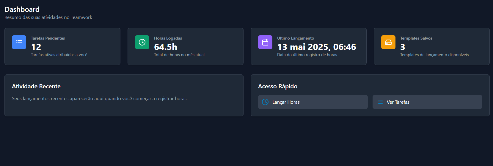
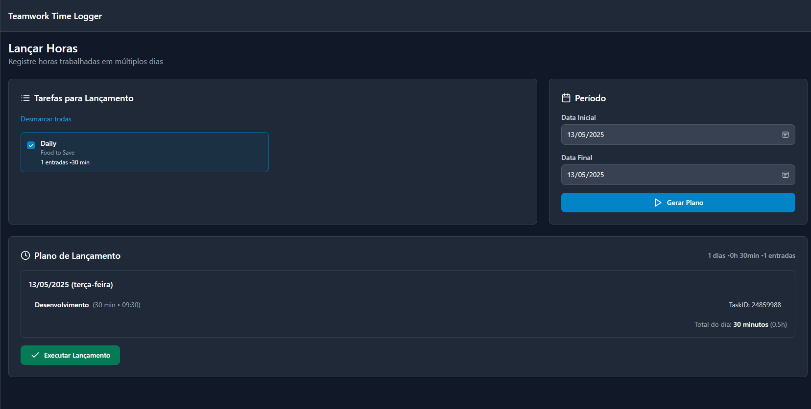
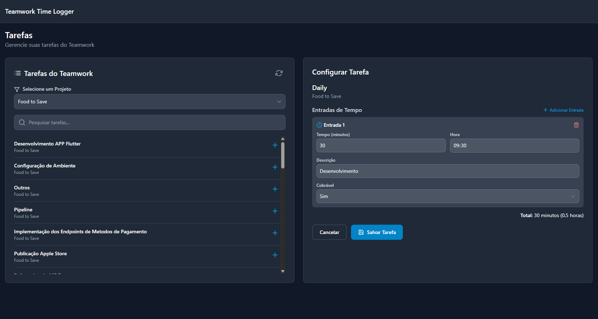
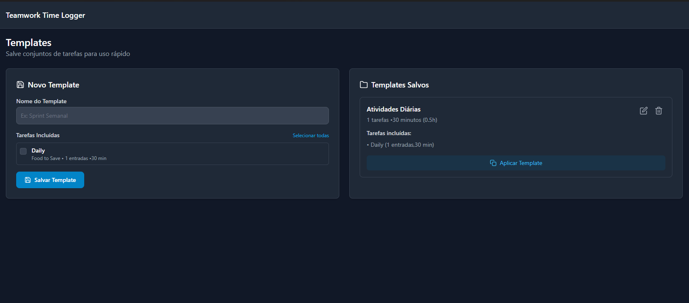
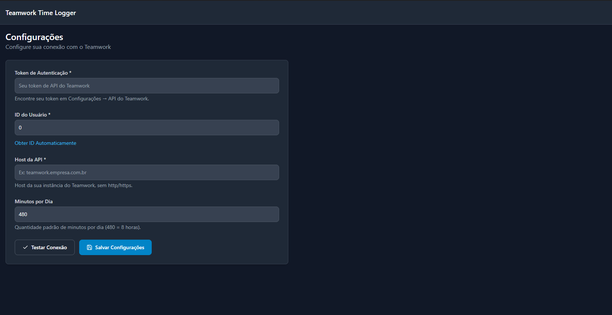

# Teamwork Time Logger


## 📝 Sobre o Projeto

O **Teamwork Time Logger** é uma aplicação desktop desenvolvida com Wails (Go + React) para facilitar o lançamento de horas trabalhadas na plataforma Teamwork. Ele foi criado para otimizar o processo de registro de tempo de trabalho, permitindo lançamentos em lote, criação de templates e gerenciamento eficiente de tarefas.

### 🌟 Principais Características

- **Lançamento de horas em lote**: Registre horas em múltiplas tarefas e dias com apenas alguns cliques
- **Templates pré-configurados**: Salve conjuntos de tarefas para uso recorrente
- **Gerenciamento de tarefas**: Visualize e organize suas tarefas do Teamwork
- **Dashboard informativo**: Tenha uma visão geral das suas atividades
- **Interface amigável**: Design moderno e intuitivo com suporte a tema escuro
- **Aplicação desktop**: Acesse rapidamente sem depender do navegador

## 🚀 Tecnologias Utilizadas

### Backend
- **Go (v1.24)**
- **Wails v2.10.1**: Framework para criação de aplicações desktop com tecnologias web

### Frontend
- **React**
- **TailwindCSS**
- **React Icons**
- **date-fns**

## 🛠️ Arquitetura do Projeto

O projeto segue uma arquitetura onde o backend em Go se comunica com a API do Teamwork e gerencia a persistência de dados locais, enquanto o frontend em React proporciona a interface de usuário.

### Estrutura de diretórios

```
teamwork-logger/
├── backend/
│   ├── api/         # Comunicação com a API do Teamwork
│   ├── config/      # Gerenciamento de configurações
│   └── app.go       # Lógica principal da aplicação
├── frontend/
│   ├── src/
│   │   ├── components/  # Componentes React
│   │   ├── pages/       # Páginas da aplicação
│   │   └── ...
│   └── ...
└── main.go          # Ponto de entrada da aplicação
```

## 🖥️ Funcionalidades

### Dashboard



O Dashboard apresenta um resumo de suas atividades no Teamwork, exibindo:
- Número de tarefas pendentes
- Total de horas logadas no mês atual
- Data do último lançamento de horas
- Templates de lançamento salvos

### Lançamento de Horas



A funcionalidade central do aplicativo permite:
- Selecionar múltiplas tarefas para lançamento
- Definir um intervalo de datas (com detecção automática de dias úteis)
- Gerar um plano de lançamento
- Enviar todos os registros ao Teamwork com um único clique
- Visualizar resultados e confirmar o sucesso das operações

### Gerenciamento de Tarefas



Permite:
- Visualizar tarefas do Teamwork por projeto
- Salvar tarefas frequentes para uso rápido
- Configurar entradas de tempo padrão para cada tarefa
- Definir descrições, duração e horário para cada entrada

### Templates



Otimize seu fluxo de trabalho com templates:
- Crie conjuntos pré-definidos de tarefas e entradas
- Aplique templates para rápido preenchimento do formulário de lançamento
- Salve configurações específicas para diferentes tipos de trabalho ou projetos

### Configurações



Configure a integração com o Teamwork:
- Token de API para autenticação
- ID do usuário
- Host da API
- Jornada diária padrão em minutos

## 🔄 Fluxo de Trabalho Típico

1. **Configuração inicial**: Configure a conexão com o Teamwork
2. **Salve suas tarefas frequentes**: Selecione e configure as tarefas que você trabalha regularmente
3. **Crie templates** (opcional): Agrupe tarefas em templates para uso recorrente
4. **Lançamento de horas**: 
   - Selecione as tarefas a serem lançadas
   - Defina o intervalo de datas
   - Gere o plano de lançamento
   - Revise e execute o lançamento
5. **Dashboard**: Acompanhe suas atividades recentes

## 💾 Armazenamento de Dados

Todos os dados são armazenados localmente em arquivos JSON no diretório `.teamwork-logger` na pasta do usuário:
- `config.json`: Configurações da aplicação e tarefas salvas
- `templates.json`: Templates de lançamento

## 🔧 Instalação e Uso

### Requisitos

- Go 1.24 ou superior
- [Wails](https://wails.io/docs/gettingstarted/installation) instalado

### Instruções

1. Clone o repositório:
   ```bash
   git clone https://github.com/seu-usuario/teamwork-logger.git
   cd teamwork-logger
   ```

2. Instale as dependências:
   ```bash
   go mod tidy
   cd frontend
   npm install
   cd ..
   ```

3. Execute em modo de desenvolvimento:
   ```bash
   wails dev
   ```

4. Para compilar:
   ```bash
   wails build
   ```

## 📊 Benefícios

- **Economia de tempo**: Automatize lançamentos repetitivos
- **Precisão**: Minimize erros no registro de horas
- **Eficiência**: Gerencie facilmente múltiplas tarefas
- **Produtividade**: Menos tempo gerenciando horas, mais tempo trabalhando
- **Facilidade**: Interface simples e intuitiva

## 📱 Planos Futuros

- Suporte a múltiplas contas Teamwork
- Notificações e lembretes para lançamento de horas
- Sincronização com calendário
- Relatórios avançados e visualizações de tempo
- Aplicativo móvel complementar

## 🤝 Contribuições

Contribuições são bem-vindas! Sinta-se à vontade para abrir issues ou pull requests.

## 📜 Licença

Este projeto está licenciado sob a [MIT License](LICENSE).

---

Desenvolvido com ❤️ para otimizar o fluxo de trabalho dos usuários do Teamwork.
